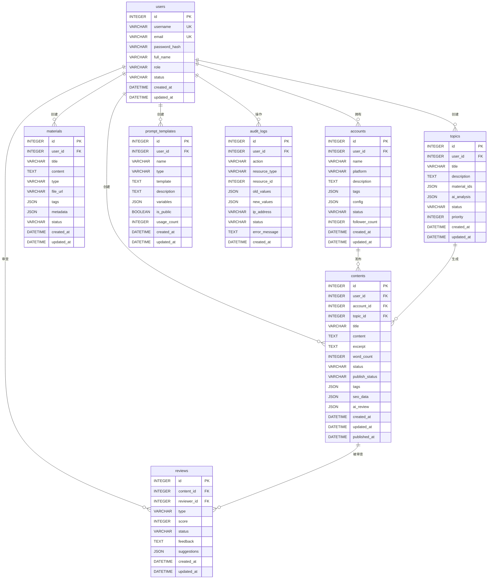

# 数据库设计文档

## 概述

AI Writer 使用 SQLite 作为数据库，采用关系型数据库设计，支持账号管理、素材管理、选题生成、内容创作等功能。本文档详细描述了数据库的结构、表关系和设计考虑。

## 数据库信息

- **数据库类型**: SQLite 3
- **数据库文件**: `./database/aiwriter.db`
- **字符集**: UTF-8
- **排序规则**: BINARY

## 表结构设计

### 1. 用户表 (users)

存储系统用户信息，支持多用户管理。

```sql
CREATE TABLE users (
    id INTEGER PRIMARY KEY AUTOINCREMENT,
    username VARCHAR(50) UNIQUE NOT NULL,
    email VARCHAR(100) UNIQUE NOT NULL,
    password_hash VARCHAR(255) NOT NULL,
    full_name VARCHAR(100),
    avatar_url VARCHAR(255),
    role VARCHAR(20) DEFAULT 'user',
    status VARCHAR(20) DEFAULT 'active',
    email_verified BOOLEAN DEFAULT FALSE,
    last_login_at DATETIME,
    created_at DATETIME DEFAULT CURRENT_TIMESTAMP,
    updated_at DATETIME DEFAULT CURRENT_TIMESTAMP
);
```

**字段说明**:
- `id`: 主键，自增
- `username`: 用户名，唯一
- `email`: 邮箱，唯一
- `password_hash`: 密码哈希值
- `full_name`: 用户全名
- `avatar_url`: 头像 URL
- `role`: 用户角色 (admin, user, guest)
- `status`: 用户状态 (active, inactive, suspended)
- `email_verified`: 邮箱是否验证
- `last_login_at`: 最后登录时间
- `created_at`: 创建时间
- `updated_at`: 更新时间

**索引**:
```sql
CREATE INDEX idx_users_username ON users(username);
CREATE INDEX idx_users_email ON users(email);
CREATE INDEX idx_users_status ON users(status);
```

### 2. 账号表 (accounts)

存储运营的公众号账号信息。

```sql
CREATE TABLE accounts (
    id INTEGER PRIMARY KEY AUTOINCREMENT,
    user_id INTEGER NOT NULL,
    name VARCHAR(100) NOT NULL,
    platform VARCHAR(50) NOT NULL,
    description TEXT,
    tags JSON,
    config JSON,
    status VARCHAR(20) DEFAULT 'active',
    follower_count INTEGER DEFAULT 0,
    created_at DATETIME DEFAULT CURRENT_TIMESTAMP,
    updated_at DATETIME DEFAULT CURRENT_TIMESTAMP,
    FOREIGN KEY (user_id) REFERENCES users(id) ON DELETE CASCADE
);
```

**字段说明**:
- `id`: 主键，自增
- `user_id`: 所属用户 ID
- `name`: 账号名称
- `platform`: 平台类型 (微信公众号, 知乎, 微博等)
- `description`: 账号描述
- `tags`: 标签数组 (JSON 格式)
- `config`: 账号配置 (JSON 格式)
- `status`: 账号状态 (active, inactive, archived)
- `follower_count`: 粉丝数量
- `created_at`: 创建时间
- `updated_at`: 更新时间

**config 字段结构**:
```json
{
  "autoPublish": false,
  "publishTime": "09:00",
  "publishDays": ["Monday", "Wednesday", "Friday"],
  "contentStyle": "professional",
  "targetAudience": "技术人群",
  "apiConfig": {
    "appId": "",
    "appSecret": ""
  }
}
```

**索引**:
```sql
CREATE INDEX idx_accounts_user_id ON accounts(user_id);
CREATE INDEX idx_accounts_platform ON accounts(platform);
CREATE INDEX idx_accounts_status ON accounts(status);
```

### 3. 素材表 (materials)

存储创作素材，支持文本、文件、链接等多种类型。

```sql
CREATE TABLE materials (
    id INTEGER PRIMARY KEY AUTOINCREMENT,
    user_id INTEGER NOT NULL,
    title VARCHAR(200) NOT NULL,
    content TEXT,
    type VARCHAR(20) NOT NULL,
    file_url VARCHAR(255),
    file_size INTEGER,
    file_type VARCHAR(50),
    tags JSON,
    metadata JSON,
    status VARCHAR(20) DEFAULT 'active',
    created_at DATETIME DEFAULT CURRENT_TIMESTAMP,
    updated_at DATETIME DEFAULT CURRENT_TIMESTAMP,
    FOREIGN KEY (user_id) REFERENCES users(id) ON DELETE CASCADE
);
```

**字段说明**:
- `id`: 主键，自增
- `user_id`: 所属用户 ID
- `title`: 素材标题
- `content`: 素材内容
- `type`: 素材类型 (text, file, link, image, audio, video)
- `file_url`: 文件 URL
- `file_size`: 文件大小 (字节)
- `file_type`: 文件类型
- `tags`: 标签数组 (JSON 格式)
- `metadata`: 元数据 (JSON 格式)
- `status`: 素材状态 (active, archived, deleted)
- `created_at`: 创建时间
- `updated_at`: 更新时间

**metadata 字段结构**:
```json
{
  "author": "",
  "source": "",
  "language": "zh-CN",
  "wordCount": 0,
  "readTime": 0,
  "extractedText": "",
  "analysis": {
    "sentiment": "positive",
    "topics": ["科技", "AI"],
    "keywords": ["人工智能", "机器学习"]
  }
}
```

**索引**:
```sql
CREATE INDEX idx_materials_user_id ON materials(user_id);
CREATE INDEX idx_materials_type ON materials(type);
CREATE INDEX idx_materials_status ON materials(status);
CREATE INDEX idx_materials_created_at ON materials(created_at);
```

### 4. 选题表 (topics)

存储 AI 生成的选题建议。

```sql
CREATE TABLE topics (
    id INTEGER PRIMARY KEY AUTOINCREMENT,
    user_id INTEGER NOT NULL,
    title VARCHAR(200) NOT NULL,
    description TEXT,
    material_ids JSON,
    ai_analysis JSON,
    status VARCHAR(20) DEFAULT 'draft',
    priority INTEGER DEFAULT 0,
    estimated_read_time INTEGER,
    created_at DATETIME DEFAULT CURRENT_TIMESTAMP,
    updated_at DATETIME DEFAULT CURRENT_TIMESTAMP,
    FOREIGN KEY (user_id) REFERENCES users(id) ON DELETE CASCADE
);
```

**字段说明**:
- `id`: 主键，自增
- `user_id`: 所属用户 ID
- `title`: 选题标题
- `description`: 选题描述
- `material_ids`: 关联素材 ID 数组 (JSON 格式)
- `ai_analysis`: AI 分析结果 (JSON 格式)
- `status`: 选题状态 (draft, approved, rejected, archived)
- `priority`: 优先级 (1-5)
- `estimated_read_time`: 预估阅读时间 (分钟)
- `created_at`: 创建时间
- `updated_at`: 更新时间

**ai_analysis 字段结构**:
```json
{
  "score": 85,
  "confidence": 0.92,
  "suggestions": [
    "建议增加具体数据支持",
    "可以加入案例研究"
  ],
  "topics": ["AI技术", "趋势分析"],
  "keywords": ["人工智能", "发展趋势"],
  "difficulty": "medium",
  "targetAudience": "技术人员"
}
```

**索引**:
```sql
CREATE INDEX idx_topics_user_id ON topics(user_id);
CREATE INDEX idx_topics_status ON topics(status);
CREATE INDEX idx_topics_priority ON topics(priority);
CREATE INDEX idx_topics_created_at ON topics(created_at);
```

### 5. 内容表 (contents)

存储生成的文章内容。

```sql
CREATE TABLE contents (
    id INTEGER PRIMARY KEY AUTOINCREMENT,
    user_id INTEGER NOT NULL,
    account_id INTEGER NOT NULL,
    topic_id INTEGER,
    title VARCHAR(200) NOT NULL,
    content TEXT NOT NULL,
    excerpt TEXT,
    word_count INTEGER DEFAULT 0,
    read_time INTEGER DEFAULT 0,
    status VARCHAR(20) DEFAULT 'draft',
    publish_status VARCHAR(20) DEFAULT 'unpublished',
    tags JSON,
    seo_data JSON,
    ai_review JSON,
    created_at DATETIME DEFAULT CURRENT_TIMESTAMP,
    updated_at DATETIME DEFAULT CURRENT_TIMESTAMP,
    published_at DATETIME,
    FOREIGN KEY (user_id) REFERENCES users(id) ON DELETE CASCADE,
    FOREIGN KEY (account_id) REFERENCES accounts(id) ON DELETE CASCADE,
    FOREIGN KEY (topic_id) REFERENCES topics(id) ON DELETE SET NULL
);
```

**字段说明**:
- `id`: 主键，自增
- `user_id`: 所属用户 ID
- `account_id`: 发布账号 ID
- `topic_id`: 关联选题 ID
- `title`: 文章标题
- `content`: 文章内容
- `excerpt`: 文章摘要
- `word_count`: 字数统计
- `read_time`: 预估阅读时间 (分钟)
- `status`: 内容状态 (draft, reviewing, approved, archived)
- `publish_status`: 发布状态 (unpublished, published, scheduled)
- `tags`: 标签数组 (JSON 格式)
- `seo_data`: SEO 数据 (JSON 格式)
- `ai_review`: AI 审查结果 (JSON 格式)
- `created_at`: 创建时间
- `updated_at`: 更新时间
- `published_at`: 发布时间

**ai_review 字段结构**:
```json
{
  "score": 92,
  "originalityScore": 95,
  "readabilityScore": 88,
  "grammarScore": 96,
  "issues": [
    {
      "type": "grammar",
      "description": "语法错误",
      "severity": "low",
      "suggestion": "修改语法"
    }
  ],
  "suggestions": [
    "建议增加更多案例",
    "可以优化段落结构"
  ],
  "keywords": ["AI", "技术", "趋势"],
  "summary": "文章质量优秀，建议增加具体案例"
}
```

**索引**:
```sql
CREATE INDEX idx_contents_user_id ON contents(user_id);
CREATE INDEX idx_contents_account_id ON contents(account_id);
CREATE INDEX idx_contents_topic_id ON contents(topic_id);
CREATE INDEX idx_contents_status ON contents(status);
CREATE INDEX idx_contents_publish_status ON contents(publish_status);
CREATE INDEX idx_contents_created_at ON contents(created_at);
```

### 6. 审查表 (reviews)

存储内容审查记录。

```sql
CREATE TABLE reviews (
    id INTEGER PRIMARY KEY AUTOINCREMENT,
    content_id INTEGER NOT NULL,
    reviewer_id INTEGER NOT NULL,
    type VARCHAR(20) NOT NULL,
    score INTEGER DEFAULT 0,
    status VARCHAR(20) DEFAULT 'pending',
    feedback TEXT,
    suggestions JSON,
    created_at DATETIME DEFAULT CURRENT_TIMESTAMP,
    updated_at DATETIME DEFAULT CURRENT_TIMESTAMP,
    FOREIGN KEY (content_id) REFERENCES contents(id) ON DELETE CASCADE,
    FOREIGN KEY (reviewer_id) REFERENCES users(id) ON DELETE CASCADE
);
```

**字段说明**:
- `id`: 主键，自增
- `content_id`: 关联内容 ID
- `reviewer_id`: 审查人 ID
- `type`: 审查类型 (ai, human, automated)
- `score`: 审查分数 (0-100)
- `status`: 审查状态 (pending, approved, rejected, needs_revision)
- `feedback`: 审查反馈
- `suggestions`: 建议数组 (JSON 格式)
- `created_at`: 创建时间
- `updated_at`: 更新时间

**索引**:
```sql
CREATE INDEX idx_reviews_content_id ON reviews(content_id);
CREATE INDEX idx_reviews_reviewer_id ON reviews(reviewer_id);
CREATE INDEX idx_reviews_type ON reviews(type);
CREATE INDEX idx_reviews_status ON reviews(status);
```

### 7. 模板表 (prompt_templates)

存储自定义 prompt 模板。

```sql
CREATE TABLE prompt_templates (
    id INTEGER PRIMARY KEY AUTOINCREMENT,
    user_id INTEGER NOT NULL,
    name VARCHAR(100) NOT NULL,
    type VARCHAR(50) NOT NULL,
    template TEXT NOT NULL,
    description TEXT,
    variables JSON,
    is_public BOOLEAN DEFAULT FALSE,
    usage_count INTEGER DEFAULT 0,
    created_at DATETIME DEFAULT CURRENT_TIMESTAMP,
    updated_at DATETIME DEFAULT CURRENT_TIMESTAMP,
    FOREIGN KEY (user_id) REFERENCES users(id) ON DELETE CASCADE
);
```

**字段说明**:
- `id`: 主键，自增
- `user_id`: 所属用户 ID
- `name`: 模板名称
- `type`: 模板类型 (topic_generation, content_generation, content_review)
- `template`: 模板内容
- `description`: 模板描述
- `variables`: 变量定义 (JSON 格式)
- `is_public`: 是否公开
- `usage_count`: 使用次数
- `created_at`: 创建时间
- `updated_at`: 更新时间

**variables 字段结构**:
```json
{
  "style": {
    "type": "string",
    "description": "写作风格",
    "default": "专业"
  },
  "wordCount": {
    "type": "number",
    "description": "字数要求",
    "default": 1000
  },
  "targetAudience": {
    "type": "string",
    "description": "目标受众",
    "default": "一般读者"
  }
}
```

**索引**:
```sql
CREATE INDEX idx_prompt_templates_user_id ON prompt_templates(user_id);
CREATE INDEX idx_prompt_templates_type ON prompt_templates(type);
CREATE INDEX idx_prompt_templates_is_public ON prompt_templates(is_public);
```

### 8. 审计日志表 (audit_logs)

记录系统操作日志。

```sql
CREATE TABLE audit_logs (
    id INTEGER PRIMARY KEY AUTOINCREMENT,
    user_id INTEGER,
    action VARCHAR(50) NOT NULL,
    resource_type VARCHAR(50) NOT NULL,
    resource_id INTEGER,
    old_values JSON,
    new_values JSON,
    ip_address VARCHAR(45),
    user_agent TEXT,
    status VARCHAR(20) DEFAULT 'success',
    error_message TEXT,
    created_at DATETIME DEFAULT CURRENT_TIMESTAMP,
    FOREIGN KEY (user_id) REFERENCES users(id) ON DELETE SET NULL
);
```

**字段说明**:
- `id`: 主键，自增
- `user_id`: 操作用户 ID
- `action`: 操作类型 (create, update, delete, read)
- `resource_type`: 资源类型
- `resource_id`: 资源 ID
- `old_values`: 旧值 (JSON 格式)
- `new_values`: 新值 (JSON 格式)
- `ip_address`: IP 地址
- `user_agent`: 用户代理
- `status`: 操作状态 (success, failed)
- `error_message`: 错误信息
- `created_at`: 创建时间

**索引**:
```sql
CREATE INDEX idx_audit_logs_user_id ON audit_logs(user_id);
CREATE INDEX idx_audit_logs_action ON audit_logs(action);
CREATE INDEX idx_audit_logs_resource_type ON audit_logs(resource_type);
CREATE INDEX idx_audit_logs_created_at ON audit_logs(created_at);
```

## 表关系图



## 数据库初始化脚本

```sql
-- 创建表结构
CREATE TABLE IF NOT EXISTS users (
    id INTEGER PRIMARY KEY AUTOINCREMENT,
    username VARCHAR(50) UNIQUE NOT NULL,
    email VARCHAR(100) UNIQUE NOT NULL,
    password_hash VARCHAR(255) NOT NULL,
    full_name VARCHAR(100),
    avatar_url VARCHAR(255),
    role VARCHAR(20) DEFAULT 'user',
    status VARCHAR(20) DEFAULT 'active',
    email_verified BOOLEAN DEFAULT FALSE,
    last_login_at DATETIME,
    created_at DATETIME DEFAULT CURRENT_TIMESTAMP,
    updated_at DATETIME DEFAULT CURRENT_TIMESTAMP
);

-- 创建其他表...
-- (此处省略其他表的创建语句，参考上面的表结构)

-- 创建索引
CREATE INDEX IF NOT EXISTS idx_users_username ON users(username);
CREATE INDEX IF NOT EXISTS idx_users_email ON users(email);
CREATE INDEX IF NOT EXISTS idx_users_status ON users(status);

-- 创建其他索引...
-- (此处省略其他索引的创建语句)

-- 插入默认管理员用户
INSERT OR IGNORE INTO users (username, email, password_hash, full_name, role, email_verified) 
VALUES ('admin', 'admin@example.com', '$2b$10$N9qo8uLOickgx2ZMRZoMy.MrqK3a7Lj.7oWXeYbW8zE8VzKJ.7UaC', '系统管理员', 'admin', TRUE);

-- 插入默认模板数据
INSERT OR IGNORE INTO prompt_templates (user_id, name, type, template, description, variables, is_public) 
VALUES (1, '默认选题生成模板', 'topic_generation', 
'基于以下素材生成选题建议：
素材内容：{materials}
目标受众：{targetAudience}
风格要求：{style}

请生成 {count} 个选题建议，每个选题包含：
1. 选题标题
2. 选题描述
3. 预估难度
4. 目标受众
5. 相关标签', 
'默认的选题生成模板', 
'{"materials": {"type": "string", "description": "素材内容"}, "targetAudience": {"type": "string", "description": "目标受众", "default": "一般读者"}, "style": {"type": "string", "description": "风格要求", "default": "专业"}, "count": {"type": "number", "description": "生成数量", "default": 5}}', 
TRUE);
```

## 数据库维护

### 备份策略
1. **自动备份**: 每日凌晨自动备份数据库
2. **手动备份**: 支持管理员手动备份
3. **版本控制**: 保留最近 30 天的备份

### 性能优化
1. **索引优化**: 定期分析查询性能，优化索引
2. **数据清理**: 定期清理过期数据和日志
3. **数据库压缩**: 定期执行 VACUUM 命令

### 安全考虑
1. **访问控制**: 严格的用户权限管理
2. **数据加密**: 敏感数据加密存储
3. **审计日志**: 完整的操作审计记录

## 总结

AI Writer 的数据库设计采用了规范化的关系型设计，支持完整的业务功能。通过合理的表结构设计和索引优化，确保了数据的一致性和查询性能。同时，通过 JSON 字段的使用，提供了良好的扩展性和灵活性。

数据库设计遵循了以下原则：
1. **规范化**: 避免数据冗余，确保数据一致性
2. **扩展性**: 通过 JSON 字段支持灵活的数据结构
3. **性能**: 合理的索引设计提高查询性能
4. **安全**: 完整的权限控制和审计机制
5. **维护**: 清晰的表结构和文档便于维护